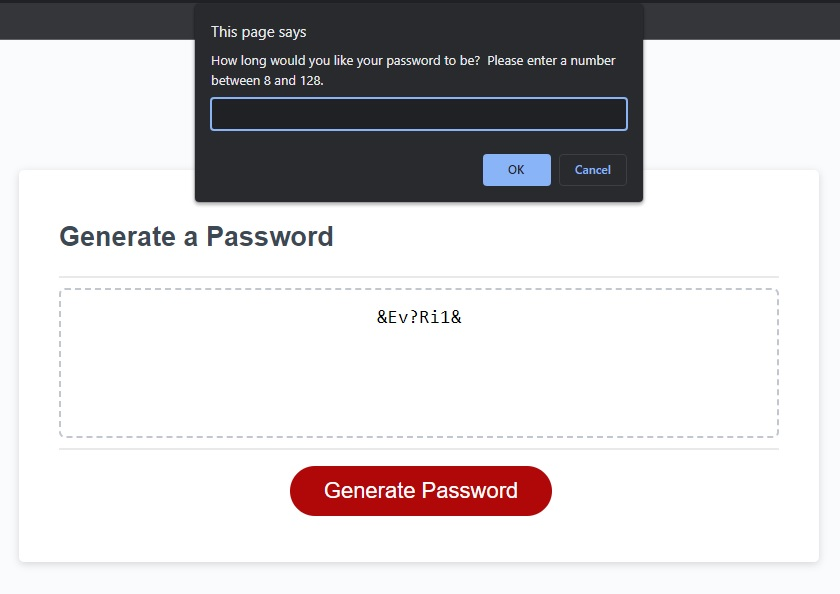

# Module 2 Portfolio Project

This project was our first attempt at making a simple website from scratch using what we have learned in HTML and CSS.  The portfolio was to contain information about me, links to various projects, and contact info, as well as many HTML and CSS elements.

## Installation

N/A
    
## Usage/Examples

Click the red 'Generate Password' button to initiate the generator.

You will then be presented with a series of prompts allowing you to specify your password parameters.

Once all of the conditions are selected a password will be displayed that mean each parameter you chose.

## Lessons Learned

The hardest part about this project (or any project so far) is finding a starting point and organizing my thoughts.  Once that was done for this password generator making the initial code was not too difficult.  However, when it came to ensuring that the final password includes an element from each parameter array I ran into some stuck.  Tutor Dennis helped me by creating an additional variable that pushed 1 random idex from each array into the final password.  

Currently that forced output is attached to the end of the generated password, and if I were to come back to this project later I would definitely add a function that randomizes the final password, including the force-added indexes.
## Acknowledgements

https://readme.so

https://www.w3schools.com

Thanks to Dennis Itua for the tutoring help, and to Donald Monpas (dev friend) for guidance.

## License

[MIT](https://choosealicense.com/licenses/mit/)

## Screenshots

